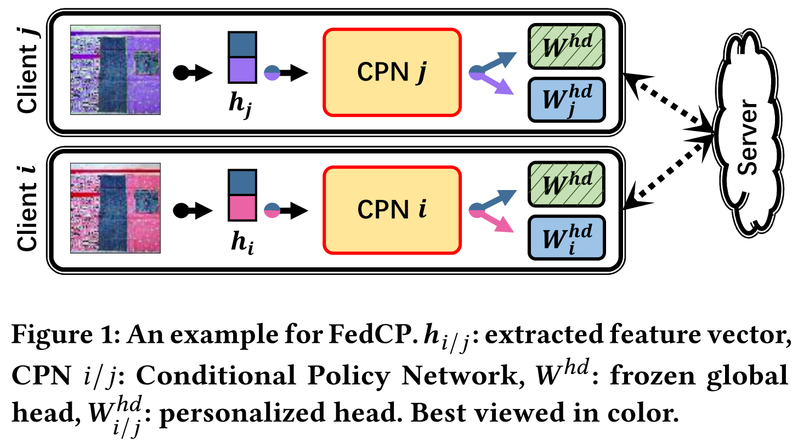
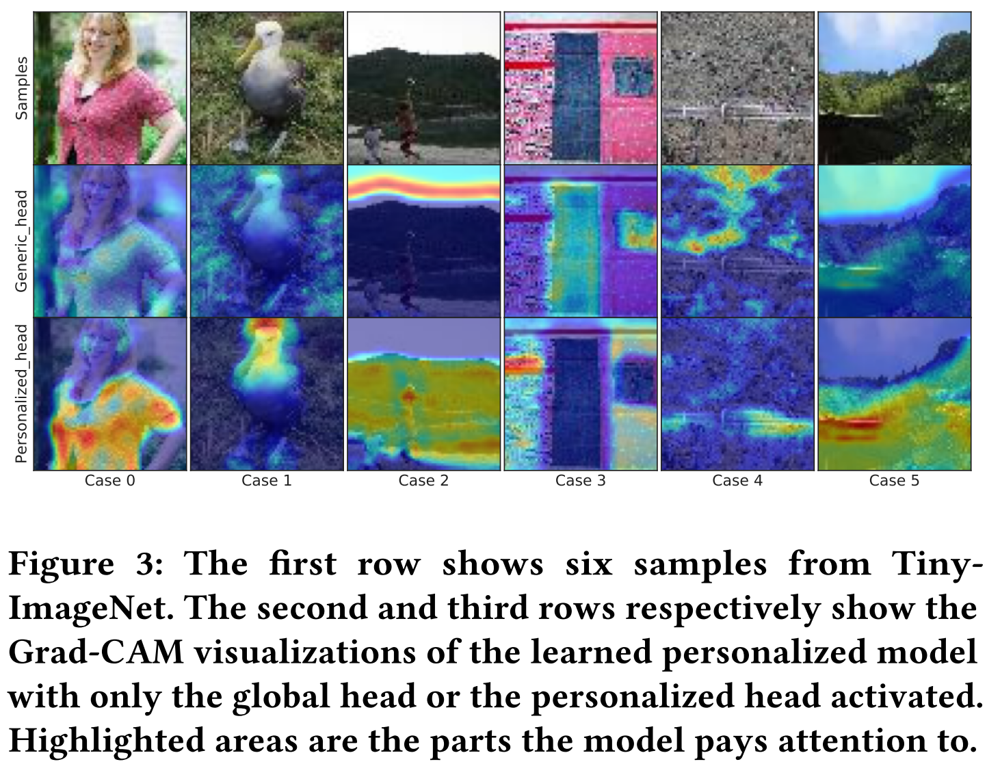
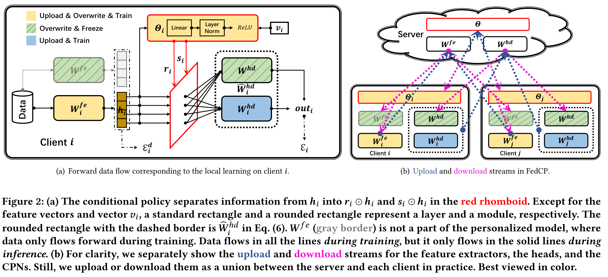

# Introduction

This is the implementation of our paper [*FedCP: Separating Feature Information for Personalized Federated Learning via Conditional Policy*](https://arxiv.org/abs/2307.01217) (accepted by KDD 2023). 

**TL;DR**: Existing personalized federated learning (pFL) mehtods focus on exploiting global and personalized information in model parameters rather than the source of information: ***data***, so we propose FedCP to automatically separate global and personalized information from data (i.e., feature representations) in iterative federated learning procedure, as shown in the following figures. 






# Dataset

Due to the file size limitation of GitHub repository, we only upload the mnist dataset with the default practical setting ($\beta=0.1$). You can generate other datasets based on my another repository [PFL-Non-IID](https://github.com/TsingZ0/PFL-Non-IID). 


# System

- `main.py`: configurations of **FedCP**. 
- `run_me.sh`: start **FedCP**. 
- `env_linux.yaml`: python environment to run **FedCP** on Linux. 
- `./flcore`: 
    - `./clients/clientcp.py`: the code on the client. 
    - `./servers/servercp.py`: the code on the server. 
    - `./trainmodel/models.py`: the code for backbones. 
- `./utils`:
    - `data_utils.py`: the code to read the dataset. 


# Conditional Policy Network (CPN)




# Simulation

## Environments
With the installed [conda](https://repo.anaconda.com/miniconda/Miniconda3-latest-Linux-x86_64.sh), we can run this platform in a conda virtual environment called *fl_torch*. 
```
conda env create -f env_linux.yaml # for Linux
```


## Training and Evaluation

All codes corresponding to **FedCP** are stored in `./system`. Just run the following commands.

```
cd ./system
sh run_me.sh # for Linux
```